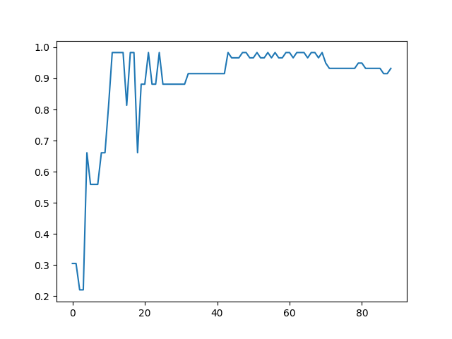

# Assignment 1 - Decision Trees
The aim project is to implement your own decision tree and then apply it to a dataset.

**About the Iris dataset**:
The dataset contains features a set of four dimensional feature vectors $(x_1,..,x_n)\in \mathbb{R}^4$ and corresponding target classes $(c_1,..,c_n)\in (0, 1, 2)$. The classes correspond to three different types of iris flowers:
* $1$ : Iris Setosa
* $2$ : Iris Versicolour
* $3$ : Iris Virginica

and the features correspond to different attributes that are shared across these flowers:
* $x_{i1}$ is sepal length in centimeters
* $x_{i2}$ is sepal width in centimeters
* $x_{i2}$ is petal length in centimeters
* $x_{i2}$ is petal width in centimeters

The complete dataset contains 150 samples of flowers, 50 of each type.

## Part 1
### Part 1.1

We can calculate impurity of data for a given class $\mathcal{C}_i$ so long as we know the probability the data belonging to that class (given that we are in the leaf node $S_j$. We use a shorthand notation for this and say:

$$
P\{\mathcal{C}_i\}=P\{x\in  \mathcal{C}_i|S_j\}
$$

So let's start calculating an estimate of $P\{\mathcal{C}_i\}
$ for the data that we have. At the root node that data is the entire training data set and the estimate is simply the estimate of the a-priori probabilities:

$$
\hat{P}\{\mathcal{C}_i\}=\frac{\sum_n^N \mathcal{I}(t_n=i)}{N}
$$

where the index function $\mathcal{I}(t_n=i)$ is one if $t_n=i$ is correct but zero otherwise (this is just counting true values) and $N$ is the number of points in the set.

Write the function `prior(targets, classes)` that calculates the prior probability of each class type given a list of all targets and all class types.

Example inputs and outputs:
* `prior([0, 0, 1], [0, 1])` -> `[2/3, 1/3]`
* `prior([0, 2, 3, 3], [0, 1, 2, 3])` -> `[1/4, 1/1/4, 0 , 2/4]`

### Part 1.2
Let's assume that we have have made a split and create two data sets for the descendent nodes of the root node. For the sake of argument, let's say the we split so that features with $x_{ik}<\theta$ is in $S_0$ and the other samples are in $S_1$.

Write a function `split_data(features, targets, split_feature_index, theta)` that returns two tuples: `(features_1 targets_1), (features_2, targets_2)` as explained above. Here, `split_feature_index` corresponds to `k`.

**Note**: We will be using the Iris dataset from now on and the `tools.load_iris()` function. You can take a look at `examples.using_iris()` for more information.

Example inputs and outputs:
```
features, targets, classes = load_iris()
(f_1, t_1), (f_2, t_2) = split_data(features, targets, 2, 4.65)
```

`f_1` should contain 90 samples and `f_2` contain 60 samples.

**Note**: In further examples in section 1, we will use this dataset split, i.e. `split_feature_index=2` and `theta=4.65`.


### Part 1.3
Now we can calculate entropy, Gini or misclassification impurity. Let's go with Gini impurity.

$$i(S_k)=\frac{1}{2}(1-\sum_iP\{\mathcal{C}_i\}^2)$$

Write a function `gini_impurity(targets, classes)` that calculates the gini impurity of a single branch.

Example inputs and outputs:

* `gini_impurity(t_1, classes)` -> 0.2517283950617284
* `gini_impurity(t_2, classes)` -> 0.1497222222222222

Using this formulation we can calculate the impurity for each branch but the question remains, what is the overall impurity of the split?

### Part 1.4

We could simply take the average:

$$i(S_0,S_1)=\frac{i(S_0)+i(S_1)}{2}$$

A better overall impurity measure is to weight the descendants node's impurity with the number of data points that belong to each class:

$$i(S_0,S_1)=\frac{N_0 i(S_0)}{N}+\frac{N_1 i(S_1)}{N}
$$

And this is the value that we want to minimize when we make a split in the tree.

Write a function `weighted_impurity(t1, t2, classes)` where `t1` are targets that belong to the first branch and `t2` belong to the second.

Example inputs and outputs:
* `weighted_impurity(t_1, t_2, classes)` -> 0.2109259259259259

### Part 1.5
Write a function that calculates $i(S_0,S_1)$

for a given dataset. It should have the form: `total_gini_impurity(features, targets, classes, split_feature_index, theta)` which returns the weighted impurity given the dataset and threshold to split on.

This function should use your `split_data` from earlier and `weighted_impurity`.

Example inputs and outputs:
```
total_gini_impurity(features, targets, classes, 2, 4.65)
```
Output: 0.2109259259259259

### 1.6
The best threshold can now be found by searching through all dimensions.  Brute force search can be used to find the best dimension and the threshold value because we have an objective function and a very simple dataset.

Create a function `brute_best_split(features, targets, classes, num_tries)` where `num_tries` corresponds to how many different thresholds to try for each feature dimension. This function should return:
1. The lowest Gini impurity value found
2. The threshold value for that value
3. The dimension where that threshold is found

Example inputs and outputs:
```
brute_best_split(features, targets, classes, 30)
```
Output: `(0.16666666666666666, 2, 1.9516129032258065)`

To determine what interval of values to test, take a look at `example.exclusive_interval`.


## Part 2
We have everything we need to implement the standard ID3 algorithm for growing decision trees, but we will use scikit-learn instead to continue.

The scikit-learn package contains utilities to train and analyse decision trees. The aim here is to set up a decision tree for the Iris dataset classification problem and to see few variations on how to deploy decision trees.

We will create a class `IrisTreeTrainer` that extends `sklearn.tree`. The class should implement the following methods:

```
Class IrisTreeTrainer:
    def __init__(self, ...):
        ...
    def train(self, ...):
        ...
    def accuracy(self, ...):
        ...
    def guess(self, ...):
        ...
    def plot(self, ...):
        ...
    def confusion_matrix(self, ...):
        ...
```

An example usage of this class would be:

```
features, targets, classes = load_iris()
dt = IrisTreeTrainer(features, targets, classes=classes)
dt.train()
print(f'The accuracy is: {dt.accuracy()}')
dt.plot()
print(f'I guessed: {dt.guess()}')
print(f'The true targets are: {dt.t_test}')
print(dt.confusion_matrix())
```

The `__init__` method is supplied to you in the template. See `example.using_classes()` for more information on python classes.
Lets now work on each method at a time.:

### Part 2.1
Implement `IrisTreeTrainer.train(self)` which should fit `self.tree` to the training data. To fit a `sklearn.tree` to some data (`features`, `targets`), we do `tree.fit(features, targets)`.

### Part 2.2
Implement `IrisTreeTrainer.accuracy(self)` which returns the accuracy of the decision tree on the test data.

### Part 2.3
Implement `IrisTreeTrainer.plot(self)` that uses `sklearn.tree.plot_tree` and `plt.show()` to display your decision tree

**Turn in the plot you get as `2_3_1.png`**

### Part 2.4
Implement `IrisTreeTrainer.guess(self)` that returns predictions on the test data. To predict using `sklearn.tree` and some data `features` we do `tree.predict(features)`.

### Part 2.5
Implement `IrisTreeTrainer.confusion_matrix(self)` that returns the [confusion matrix](https://en.wikipedia.org/wiki/Confusion_matrix) on the test data. You should implement this metric yourself!

## Bonus Part
**Note:** *This is a pre-formulated bonus question. In future assignments you will be asked to demonstrate your capability to add relevant insight to your assignment. The work suggested below is examplary of the type of insight you might add in future assignments. To get full marks on this assignment you must complete this bonus part.*

Add a method `IrisTreTrainer.plot_progress()` to the class that plots the accuracy on the test set as a function of training samples. You should start by training on only one sample and end on training on all the training samples.

**Turn in the plot you get as `bonus_1.png`**

Running the following code should result in a similar graph as the one below:

```
features, targets, classes = load_iris()
dt = IrisTreeTrainer(features, targets, classes=classes, train_ratio=0.6)
dt.plot_progress()
```


