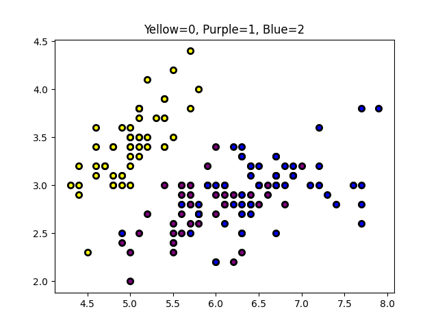
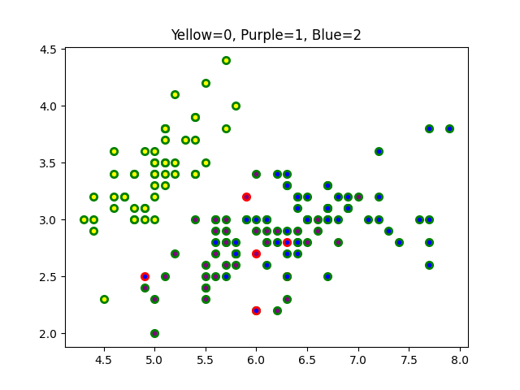
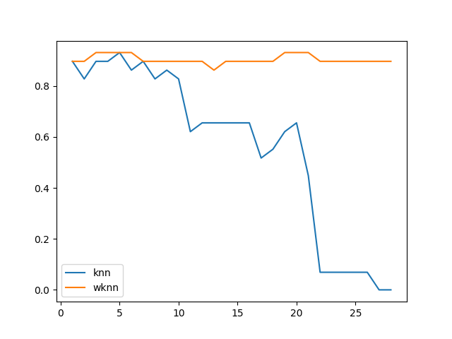

# K-Nearest Neighbours
The aim the exercise is to implement the KNN algorithm and evaluated using cross-validation on the Iris data set. The implementation will also be evaluated by comparing it with the scikit-learn implementation.

## Part 1.
The first step is to implement the kNN algorithm. The kNN algorithm uses a distance calculation of some sort to determine which points are neighbours.

You can use `tools.plot_points()` to see a scatter plot of the first two dimensions of all points in the Iris set:

```
d, t, classes = load_iris()
plot_points(d, t)
```

This results in the following image




### Part 1.1
Implement a distance calculation so that we get the distance between a specific point to all the other points in the set. Use the [Euclidean distance](https://en.wikipedia.org/wiki/Euclidean_distance):

$$
d_n=\sqrt{\sum_{j=1}^D(x_j-x^{train~n}_j)^2}
$$

wher $x^{train~n}$ is the $n$-th vector in the training set. The outcome of this step is a vector containing all $d_n$.

Create a function `euclidian_distance(x, y)` that calculates the euclidian distance between `x` and `y`.

Example inputs and outputs:

First seperate one point from the iris dataset. This will also be used in the following examples
```
d, t, classes = load_iris()
x, points = d[0,:], d[1:, :]
x_target, point_targets = t[0], t[1:]
```
1. `euclidian_distance(x, points[0])` -> `0.5385164807134502`
2. `euclidian_distance(x, points[50])`-> `3.6166282640050254`


### Part 1.2
The kNN algorithm calculates the euclidian distance between a point `x` and all other `points`. Create a new function `euclidian_distances(x, points)` that uses your `euclidian_distance` to perform this calculation.

Example inputs and outputs:
`euclidian_distances(x, points)` -> `[0.53851648 0.50990195 0.64807407 0.14142136 0.6164414  0.51961524 ..., 4.14004831]`


### Part 1.3
The next step in the algorithm is to find the $k$ nearest point to `x`. Using your `euclidian_distances`, create a function `k_nearest(x, points, k)` that returns the indices of the $k$ nearest points.

Example inputs and outputs:
1. `k_nearest(x, points, 1)` -> `[16]`
2. `k_nearest(x, points, 3)` -> `[16 3 38]`

**Hint:** Use `np.argsort`

### Part 1.4
The final step in the kNN algorithm is the vote. After finding $k$-nearest points, we vote for the most common class label among the nearest points.

Create a function `vote(targets, classes)` that returns the most common class label.

Example inputs and outputs:
1. `vote(np.array([0,0,1,2]), np.array([0,1,2]))` -> `0`
2. `vote(np.array([1,1,1,1]), np.array([0,1]))` -> `1`

### Part 1.5
You have now made all the building blocks for the kNN algorithm and it's time to put them together.

Create a function `knn(x, points, point_targets, classes, k)` where:
1. `x` is a test point
2. `points` are all other points in the dataset
3. `point_targets` are the class labels for all `points`
4. `classes` are all possible class labels
5. `k` is the number of required nearest neighbours.

The function should return a single value, the class label that your algorithm guesses is the class label of the test point.

Example input and output:
1. `knn(x, points, point_targets, classes, 1)` -> `0`
2. `knn(x, points, point_targets, classes, 5)` -> `0`
2. `knn(x, points, point_targets, classes, 150)` -> `1`

Is your algorithm correct for the value of `k` you choose (i.e. does it correspond to `x_target`)?

## Part 2
We will now evaluate the performance of the kNN algorithm on the Iris dataset by calculating the accuracy of class predictions.


### Part 2.1
Create a function `knn_predict(points, point_targets, classes, k)` which uses your `knn` function to predict a class label for each point in `points`. `help.remove_one(points, i)` might be helpful here. This function should achieve the same as your `knn` function but on multiple points and should therefore call your `knn` function.

We should be evaluating the algorithm on a seperated test set and we can use `tools.split_train_test` for that:

Example inputs and outputs:

```
d, t, classes = load_iris()
(d_train, t_train), (d_test, t_test) = split_train_test(d, t, train_ratio=0.8)
```
1. `predictions = knn_predict(d_test, t_test, classes, 10)` -> `[2 2 2 2 0 1 0 1 1 0 1 2 1 2 2 0 1 0 2 1 1 1 1 1 2 0 1 1 1]`
2. `predictions = knn_predict(d_test, t_test, classes, 5)` -> `[2 2 2 2 0 1 0 1 1 0 1 2 1 2 2 0 1 0 2 2 1 1 2 1 2 0 1 1 2]`


### Part 2.2
Create a function `knn_accuracy(targets, point_targets, classes, k)` that calculates the accuracy of your predictions. You should of course use your `knn_predict` for this.

Example inputs and outputs:
1. `knn_accuracy(d_test, t_test, classes, 10)` -> `0.8275862068965517`
2. `knn_accuracy(d_test, t_test, classes, 5)` -> `0.9310344827586207`


### Part 2.3
Create a function `knn_confusion_matrix(points, point_targets, classes, k)` that should build a confusion matrix similarily to how we made the confusion matrix in [assignment 1](../01_decision_trees/README.md).

Example inputs and outputs:
1. `knn_confusion_matrix(d_test, t_test, classes, 10)`
```
[[ 6.  0.  0.]
 [ 0. 10.  4.]
 [ 0.  1.  8.]]
```

2. `knn_confusion_matrix(d_test, t_test, classes, 20)`
```
[[ 0.  0.  0.]
 [ 6.  8.  1.]
 [ 0.  3. 11.]]
```

### Part 2.4
Based on the examples above, it seems like the choice of `k` is an important influence on the accuracy of the classifier. We therefore want to pick a good value of $k$, but how?

The way to do this is to evaluate multiple values of $k$ on the training set and pick the one that works best. Create a function `best_k(points, point_targets, classes)` that returns the value of $k$ that corresponds to the highest accuracy on the point set. You should test values of $K$ in the interval $[1, N-1]$ where $N$ is the number of points in the point set.

Example inputs and outputs.

`best_k(d_train, t_train, classes)` -> `9`

### Part 2.5
Create a function `knn_plot_points(points, point_targets, classes, k)`. The function should look very similar to `tools.plot_points` but differs in that:
1. This function should get a prediction for each point
2. Set the `edgecolor` argument to `green` if the prediction is correct, otherwise `red`.

Example input and output:
Calling `knn_plot_points(d, t, classes, 3)` results in the following image



Submit yours as `2_5_1.png`.


## Bonus Part
**Note:** *This is a pre-formulated bonus question. In future assignments you will be asked to demonstrate your capability to add relevant insight to your assignment. The work suggested below is examplary of the type of insight you might add in future assignments. To get full marks on this assignment you must complete this bonus part.*


The [Weighted Nearest Neighbour algorithm](https://en.wikipedia.org/wiki/K-nearest_neighbors_algorithm#The_weighted_nearest_neighbour_classifier) (wkNN) expands on the kNN algorithm by weighing votes.

The intuition used in wkNN is that neighbours that are really close should have a bigger say in the classfication than neighbours far away.

In wkNN, the prediction $\hat{y}_i$ for a given point $x_i$ is

$$
\hat{y}_i = \frac{c_1y_1 + c_2y_2 + ... + c_ky_k}{\sum_{j=1}^{k} c_j}
$$

where $y_j$ is the vote made by neighour $i$ and $c_j$ is the corresponding weight. But how should the weights be formalized? The weight should be large when the neighbour is close to $x_i$ and small when far away. The simplest way to achieve this is to say that

$$
c_j = \frac{1}{\text{distance}(x_i, x_j)}
$$

### B.1
Create the function `weighted_vote(targets, distances, classes)` that returns the class label with the highest vote mass according to the scheme above.


### B.2
Create the function `wknn(x, points, point_targets, classes, k)` that achieves the same as your `knn` function but uses `weighted_vote` instead

### B.3
Create the function `wknn_predict(points, point_targets, classes, k)` that achieves the same as `knn_predict` but uses `wknn` instead of `knn`.

### B.4
Finally we will compare the accuracy of kNN and wkNN as a function of $k$. Create the function `compare_knns(points, targets, classes)` that calculates the accuracies of `knn` and `wknn` for $k\in(1; n)$ where $n$ is the number of points. Then plot both types of accuracies as a function of $k$ in the same plot.

Your plot should look something like the following. Submit your plot as `b_4_1.png`.



### B.Theoretical
What explains this difference in accuracy between kNN and wkNN when $k$ increases?


