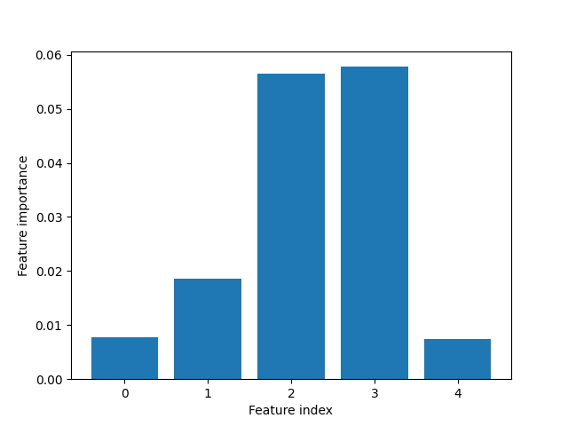

# Random Forests
This exercise focuses on ensemble methods using decision trees. In particular we will explore Random Forests and Extremely Randomized Trees which are methods that take extra steps in creating variety in the base learner, the decision trees, in the ensemble.

In this assignment we will continue to use the cancer dataset that we used in the previous assignment.

## Section 1
In the first section we will take steps towards ensemble classifier methods using vanilla decision trees.

### Section 1.1
Before we try out an ensemble classifier based on trees, let's first apply a single decision tree to see what we can improve on. In this assignment we will be using the class `CancerClassifier` to carry out experiments. The only two input arguments to `CancerClassifier` is `classifier` and `train_ratio`. In general, `classifier` can be any type of `sklearn` classifier like `sklearn.tree.DecisionTreeClassifier`.

To start with, finish implementing the following methods of the `CancerClassifier` class:
* `confusion_matrix()`
* `accuracy()`
* `precision()`
* `recall()`
* `cross_validation_accuracy()`

The last method should perform 10-fold cross validation on the entire cancer dataset and return the average accuracy of those 10 folds.

Example of usage:
```
classifier_type = sklearn.some.Classifier(param=3)
cc = CancerClassifier(classifier_type)
print(cc.accuracy())
```

### Section 1.2
*This question should be answered on Mimir*

Now run `CancerClassifier` with a `DecisionTreeClassifier`. and evaluate the performance with the methods that you have finished implementing. Answer the following questions:
1. Upload the result for each metric (confusion matrix, accuracy, precision, recall, cross validation accuracy)
2. What does the precision and recall tell us that the accuracy can't?
3. What could possibly explain the difference between accuracy and cross validation accuracy?
4. How would you suggest a confusion matrix, precision and recall for cross validation would be formulated?


## Section 2
Bagging where the base learners are decision trees are often referred to as *tree bagging*. Each decision tree is trained using a bootstrap subset of the training set to create variety amongst the base learners. Random forests go even further and create more variety by sampling the features when making splits in each node in each decision tree. This means that in a given node, instead of using for example all $D=10$ features, the algorithm will choose a subset of a set value, say  $d=3$ , in this instance features 4, 6 and 10. Another node would be a different subset, say features 2, 5 and 7.

A typical choice of  $d$ is $\sqrt{D}$ or $\text{log}_2(D)$. The number of features (attributes) for our problem is of course 30, the dimensionality of each feature vector in the dataset.

### Section 2.1
*This question should be answered via Mimir*

Implement a vanilla random forest and apply to the problem in the same way that the decision tree was evaluated, using your `CancerClassifier`.

1. Upload the result for each metric (confusion matrix, accuracy, precision, recall, cross validation accuracy)

2. What is the best combination of a total number of trees in the forest (`n_estimators`) and the maximum number of features considered in each split (`max_features`) that you can find? What are the metric results for this parameter selection?

### Section 2.2.
Add a method to your class called `feature_importance` that plots a bar plot of feature importances for the random forest and returns a list of feature indices sorted by importance (highest first). You can access feature importance of a `sklearn` classifier with `classifier.feature_importances_`.

Example inputs and outputs:
```
cc = CancerClassifier(my_classifier)
feature_idx = cc.feature_importance()
```
First a plot should appear then when the user has escaped the plot window the user can access the feature indexes.
```
>> feature_idx
[22, 6, 7, ...]
```

For the first 5 features, this plot looks like the  following:



Upload your plot as `2_2_1.png`

### Section 2.3
*This question should be answered via Mimir*
1. Describe how feature importance is calculated
2. Which feature is the most important and which is the least important. Use information from either [assignment 8](../08_SVM/README.md) or [here](https://www.kaggle.com/uciml/breast-cancer-wisconsin-data) to name these features.

### Section 2.4
[OOB Errors for Random Forests](https://scikit-learn.org/stable/auto_examples/ensemble/plot_ensemble_oob.html#sphx-glr-auto-examples-ensemble-plot-ensemble-oob-py) is the average error for each training example calculated using predictions from the trees that do not contain that training sample in their respective bootstrap sample. This means that a Random forest can be trained and validated simultaneously. The validation data is precisely the data that is **not** used to determine the parameters in the decision trees.

Let's examine the development of the out-of-bag error as we increase the size of the forest. Adapt the code in the link to the cancer dataset and generate the plot. You can use `_plot_oob_error` for this.

Turn in your plot as `2_4_1.png`.

### Section 2.5
*This question should be answered via Mimir*
1. What can be said about the relationship between the OOB error rate and the number of estimators?
2. Do all three types of ensembles follow this correlation?

## Section 3
Extremely Randomized Trees are just like Random Forests in that they are an ensemble of decision trees that are trained on bootstrap subsets of the training data and in each split a random subset of features are taken into consideration. But instead of searching for an optimum threshold amongst the candidate features in each split, random thresholds are tested, one per candidate feature, and then the best split is chosen amongst those.

### Section 3.1
*This question should be answered via Mimir*

Now run `CancerClassifier` with a `ExtraTreesClassifier`

Plot the same feature importance bar plot as before. Upload it as `3_1_1.png`.

1. Upload the result for each metric (confusion matrix, accuracy, precision, recall, cross validation accuracy)
2. What is the most important feature and the least important feature?


### Section 3.2
Now make a similar plot to the one in section 2.4 but now with extremely randomized trees. You can use `_plot_extreme_oob_error` for this.

Upload your plot as `3_2_1.png`.


### Bonus
This is an open ended bonus section. You are welcome to analyze these models further, test them out on other datasets, compare parameters w.r.t. accuracy, recall, etc.
