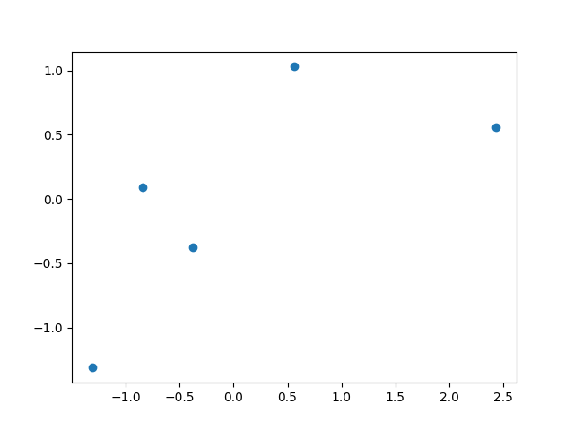
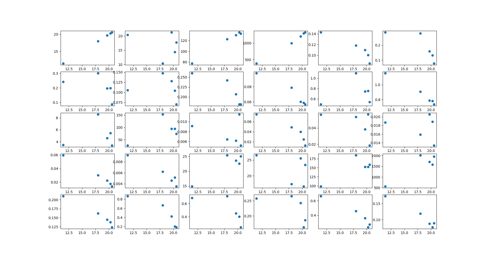
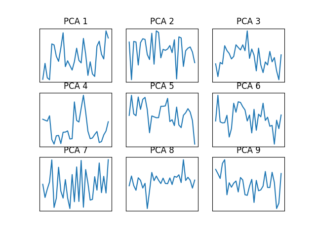

# Principal Component Analysis
Principal component analysis (PCA) is a technique to project data from higher dimension ($D$) to a lower dimension ($M$). There are a few reasons for why this is a good idea. It can, for example be a good pre-processing step for supervised classification or regression. Another reason to project the data to lower dimension is to visualize the data.

In this exercise, we will examine principal component analysis for the breast cancer data set.

## Section 1
To understand the importance of PCA we will start with a small experiment, simulating *naive PCA*.

### Section 1.1
Create a function `standardize(x)` which takes in a $[N \times f]$ array and returns a standardized version of it. This function returns a $[N \times f]$ array $\hat{X}$ where
$$
    \hat{x_i} = \frac{x_i - \overline{x}}{\sigma_x}, \quad (\hat{x}_i, x_i, \overline{x}, \sigma_x) \in \mathbb{R}^f, \quad i \in 1,2,...,N
$$

Example input and output:

`standardize(np.array([[0, 0], [0, 0], [1, 1], [1, 1]]))` ->
```
[[-1. -1.]
 [-1. -1.]
 [ 1.  1.]
 [ 1.  1.]]
```

### Section 1.2
Finish the function `scatter_standardized_dims(X, i, j)` that takes in an array $X$ of shape $[N \times f]$ and plots a scatter plot for all points
$$
(\hat{X}_{ni}, \hat{X}_{nj}), \quad n = 1,2,...,N
$$

Example input and output:
```
X = np.array([
    [1, 2, 3, 4],
    [0, 0, 0, 0],
    [4, 5, 5, 4],
    [2, 2, 2, 2],
    [8, 6, 4, 2]])
scatter_standardized_dims(X, 0, 2)
plt.show()
```
This results in the following boring plot



**Make sure to not call `plt.show()` inside this function**

### Section 1.3
Lets now try our scatter on the breast cancer data. You can load in the the complete cancer data with `X, y = tools.load_cancer()`.

We will create a scatter for every feature dimension against the first one. Each sample in the cancer dataset has 30 dimensions, that means that we will plot 30 plots:
1. scatter dimension 1 against dimension 1
2. scatter dimension 1 against dimension 2
3. ...
30. scatter dimension 1 against dimension 30

We will be using `plt.subplot` for this. Your plot grid should have 5 rows and 6 columns. To plot the i-th subplot in a 5-by-6 grid we call `plt.subplot(5, 6, i)` just before we draw the plot. You can use `_scatter_cancer` for this.

For only the first 5 points in the dataset this plot looks like this:



Submit your plot as `1_3_1.png`.

### Section 1.4
*This question should be answered via Mimir*

Judging from all these plots, which dimensions do you think correlate best with the first dimension?

Using the information [here](../08_SVM/README.md), what are the names of those features?

Can you explain why it makes sense that these are the dimensions that best correlate with the first one as opposed to the other dimensions?


## Section 2
You have now been introduced to a minified version of PCA. We will now do full PCA on the cancer data.


### Section 2.1
We will be using `sklearn.decomposition.PCA`, read more [here](https://scikit-learn.org/stable/modules/generated/sklearn.decomposition.PCA.html). Create a new `pca = PCA()` instance and set `n_properties`, i.e. $M$, to $D$.

To fit `pca` to a set of features $X$, we do `pca.fit_transform(X)` which then applies the dimensionality reduction to $X$. You should be fitting the model to the standardized version of $X$.

After that we can get the *components* (or eigenvectors) of the model with `pca.components_`.

Now, plot the value of the first three components. Finish the `_plot_pca_components` function to produce this plot.

For much less data and only 9 components this plot looks like the following.



Submit your plot as `2_1_1.png`.


> **Note**:
>
>It is not obvious how to use these to interpret the PCA component for this specific data matrix (breast cancer sample), but more knowledge about the dimensions could provide further insight.
>
>Usually when the elements in the data vectors are connected (for example when they represent a signal of some sort) the PCA components provide a good insight into how the data looks like. Popular example of this is when the data "vector" is a facial image. This two-dimensional signal can be broken down into PCA components which are called "eigenfaces". An example of this can be seen [here](https://scikit-learn.org/stable/auto_examples/applications/plot_face_recognition.html).


## Section 3 - Variance Reduction
The variance in the data can be gauged through the eigenvalues of the covariance matrix. These are accessible in the `pca.explained_variance_` property. (Let's call them  $\lambda_i$ for simplicity).

### Section 3.1
Plot the eigenvalues $\lambda_i$ as a function of $i$.

You can use `_plot_eigen_values` for this. Submit your plot as `3_1_1.png`.


### Section 3.2
Plot the log (base 10) of the eigenvalues, i.e. $\text{log}_{10}(\lambda_i)$, as a function of $i$.

You can use `_plot_log_eigen_values` for this. Submit your plot as `3_2_1.png`.

### Section 3.3
Plot the cumulative variance (eigenvalue), i.e.
$$
    \frac{\sum_{j=1}^i \lambda_j}{\sum_{j=1}^D \lambda_j}
$$

as a function of of $i$. The function `np.cumsum` might come in handy here.

You can use `_plot_cum_variance` for this. Submit your plot as `3_3_1.png`.

### Section 3.4
*This question should be answered via Mimir*

 Using your knowledge about PCA and your plots, can you explain why they look like they do? Explain why the eiginvalue plot has the trend that it does and the same for the cumulative variance plot.


 ## Bonus
 This is a completely independent bonus section.

 Make an experiment of your choice, relevant to PCA, and present your results and all added code with plots and figures is applicable.


